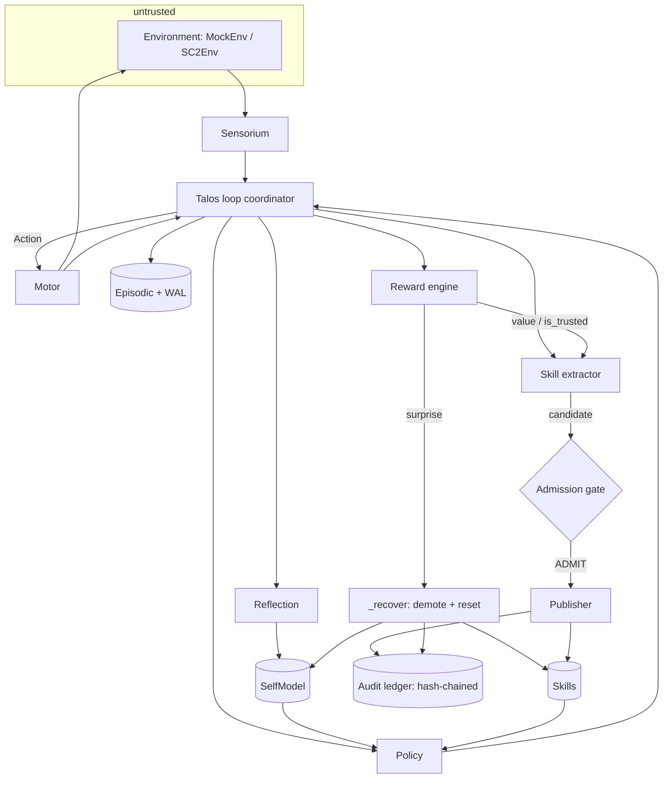

# Architecture Graph — Talos_Kain (as built)

Structural view. The dashed boundary is the untrusted world (the Environment).
The gate sits between nominating a skill and writing it (D-002 / G1).

```mermaid
graph TD
  subgraph WORLD [untrusted]
    ENV[Environment: MockEnv / SC2Env]
  end
  ENV --> SEN[Sensorium]
  SEN --> LC[Talos loop coordinator]
  LC --> POL[Policy]
  POL --> LC
  LC -->|Action| MOT[Motor]
  MOT --> ENV
  MOT --> LC
  LC --> EPI[(Episodic + WAL)]
  LC --> REF[Reflection]
  REF --> SM[(SelfModel)]
  SM --> POL
  LC --> RW[Reward engine]
  RW -->|surprise| REC[_recover: demote + reset]
  REC --> SKL
  REC --> SM
  LC --> EXT[Skill extractor]
  RW -->|value / is_trusted| EXT
  EXT -->|candidate| GATE{Admission gate}
  GATE -->|ADMIT| PUB[Publisher]
  PUB --> SKL[(Skills)]
  PUB --> AUD[(Audit ledger: hash-chained)]
  REC --> AUD
  SKL --> POL
```
