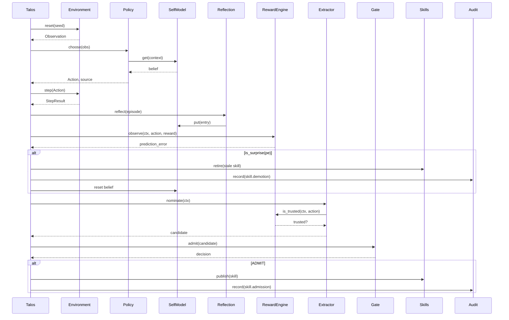

# Execution Map — Talos_Kain (as built)

Control view: one episode. `Talos` owns control; the policy never writes a
store, and the reward path runs only *after* the action (async modulation — see
the "Boundaries" section in Contracts). Recovery is conditional on a surprise.

